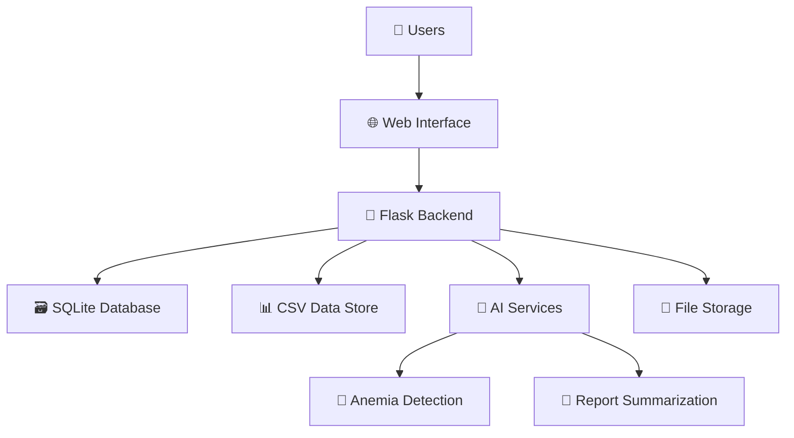

# 🏥 Telemedicine Platform

<div align="center">
  
  
  
  
  
  
</div>

<br>

A comprehensive Flask-based telemedicine platform that revolutionizes healthcare by connecting patients, doctors, and administrators through an intelligent, AI-powered ecosystem. Our platform makes healthcare more **accessible**, **affordable**, and **smarter** by integrating cutting-edge technologies like machine learning for anemia detection and NLP for medical report analysis.

---

## ✨ **Key Features**

<table>
<tr>
<td width="33%" align="center">

### 👨‍⚕️ **For Patients**
- 🔐 **Secure Authentication** with password hashing
- 📅 **Smart Appointment Booking** system
- 📄 **Lab Report Management** (upload/download)
- 💊 **Medication Search** for common diseases
- 🩺 **AI Anemia Detection** from blood smear images
- 📋 **AI Report Summarization** for easy understanding

</td>
<td width="33%" align="center">

### 👩‍⚕️ **For Doctors**
- 👤 **Complete Profile Management**
- 💬 **Patient Query System**
- 📊 **Patient Record Access**
- 🗓️ **Appointment Management**
- 🔍 **Medical History Tracking**
- 📈 **Patient Progress Monitoring**

</td>
<td width="33%" align="center">

### 🛠️ **For Administrators**
- 👨‍⚕️ **Doctor Management** (add/update/remove)
- 👥 **Patient Monitoring**
- 📊 **System Analytics**
- 📅 **Appointment Oversight**
- 📈 **Platform Performance Tracking**
- 🔧 **System Configuration**

</td>
</tr>
</table>

---

## 🤖 **AI-Powered Intelligence**

<div align="center">
  
| 🔬 **Anemia Detection** | 📄 **Report Summarization** |
|:---:|:---:|
| Advanced TensorFlow CNN model | Hugging Face T5 Transformer |
| Blood smear image analysis | NLP-powered medical insights |
| Real-time diagnostic assistance | Simplified medical language |

</div>

---

## 🛠️ **Technology Stack**

```
🖥️  Backend         │  Flask, FastAPI (AI Services)
🗃️  Database        │  SQLite + CSV Integration  
🎨  Frontend        │  HTML5, CSS3, JavaScript, Jinja2
🔒  Security        │  Flask-Bcrypt, Flask-Session
🤖  AI/ML           │  TensorFlow, Hugging Face, XGBoost
📊  Data Science    │  Pandas, NumPy
🖼️  Image Processing │  Pillow (PIL)
```

---

## ⚡ **Quick Start Guide**

### 1️⃣ **Clone Repository**
```bash
git clone https://github.com/your-username/telemedicine.git
cd telemedicine/backend
```

### 2️⃣ **Environment Setup**
```bash
# Create virtual environment
python3 -m venv venv

# Activate environment
source venv/bin/activate   # 🐧 Linux/Mac
venv\Scripts\activate      # 🪟 Windows
```

### 3️⃣ **Install Dependencies**
```bash
pip install -r requirements.txt
```

### 4️⃣ **Launch Application**
```bash
flask run
```

### 5️⃣ **Access Platform**
Open your browser and navigate to: **http://127.0.0.1:5000/**

---

## 🏗️ **System Architecture**



---

## 📊 **Data Management Strategy**

| **Component** | **Storage Method** | **Purpose** |
|:---|:---|:---|
| 👥 **Patient Data** | SQLite Database | Secure user information & medical records |
| 🗓️ **Appointments** | SQLite Database | Booking & scheduling management |
| 👨‍⚕️ **Doctor Profiles** | CSV Files | Quick access & easy management |
| 💊 **Medications** | CSV Files | Drug information & search functionality |
| 📄 **Lab Reports** | File System | Secure document storage & retrieval |

---

## 🚀 **Future Roadmap**

<div align="center">
  
| Phase | Feature | Description |
|:---:|:---|:---|
| 🎯 **Phase 1** | **Real-time Consultations** | WebRTC-powered video calls |
| 🌍 **Phase 2** | **Multi-language Support** | Expanded accessibility |
| 🧠 **Phase 3** | **Advanced AI Diagnostics** | Predictive health analytics |
| 📱 **Phase 4** | **Mobile Applications** | iOS & Android native apps |
| 🔗 **Phase 5** | **API Integration** | Third-party healthcare systems |

</div>

---

## 🤝 **Contributing**

We welcome contributions from the community! Please feel free to:

- 🐛 Report bugs and issues
- 💡 Suggest new features
- 🔧 Submit pull requests
- 📖 Improve documentation

---

## 📜 **License**

This project is licensed under the MIT License - see the [LICENSE](LICENSE) file for details.

---

<div align="center">
  
### 🌟 **Made with ❤️ for Healthcare Innovation**

**[⭐ Star this repo]([https://github.com/your-username/telemedicine](https://github.com/VAMSIPOLIPARTHI/swasthya))** 


</div>

---

<div align="center">
  <sub>Built with modern technologies to make healthcare accessible to everyone, everywhere.</sub>
</div>
